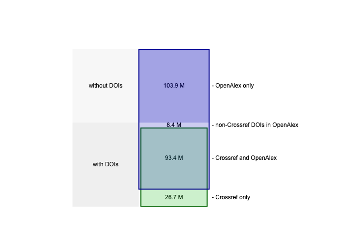
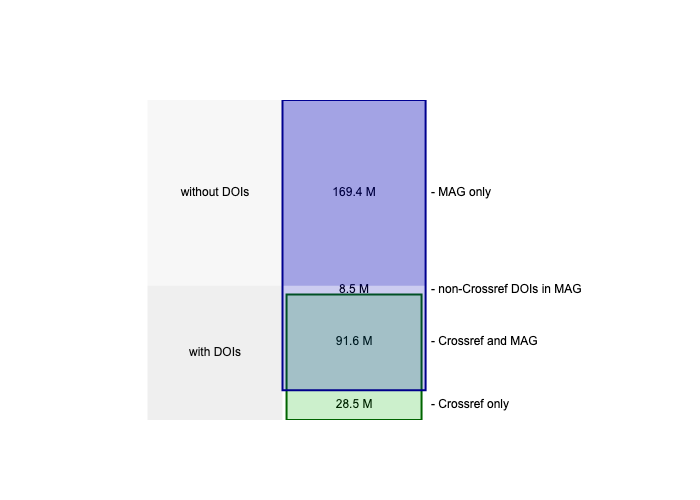
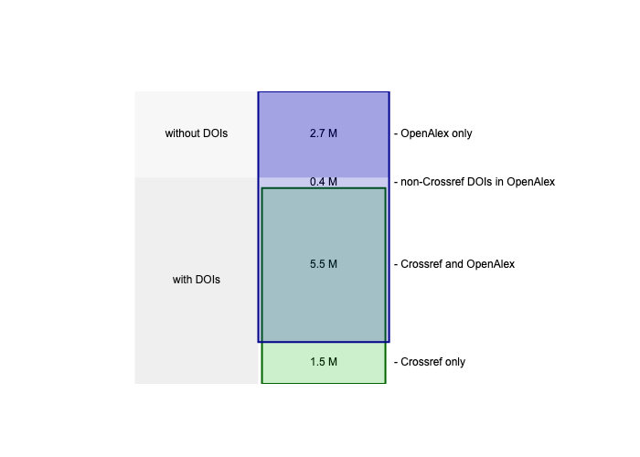
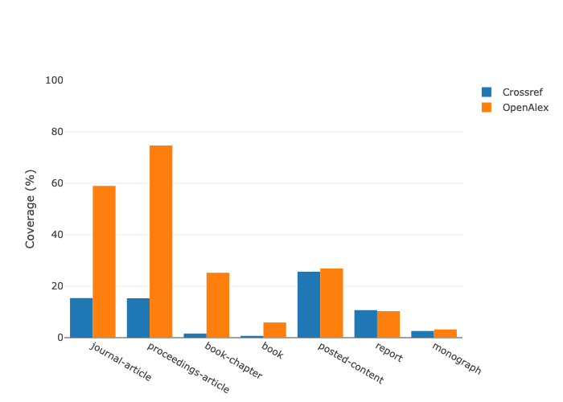
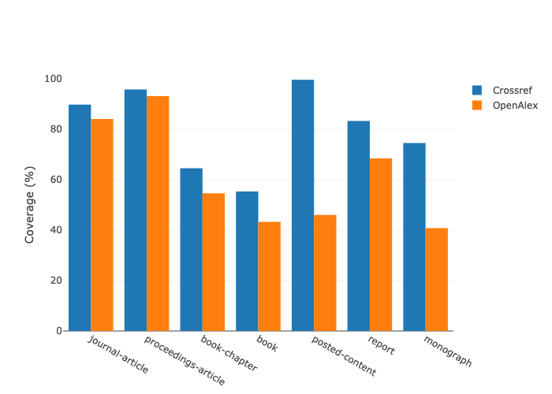
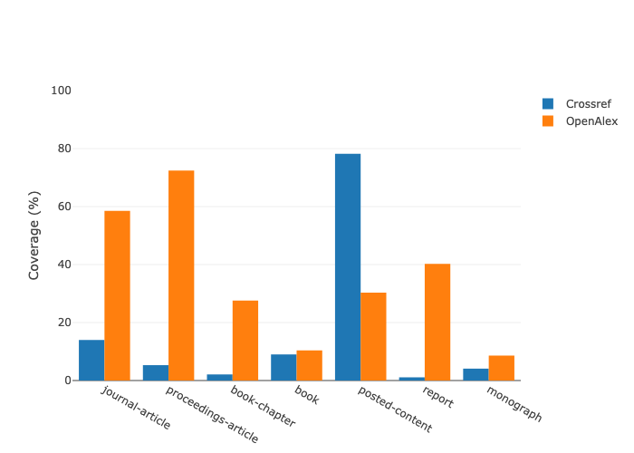
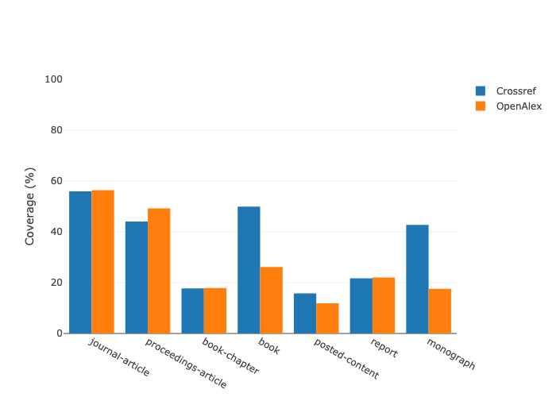
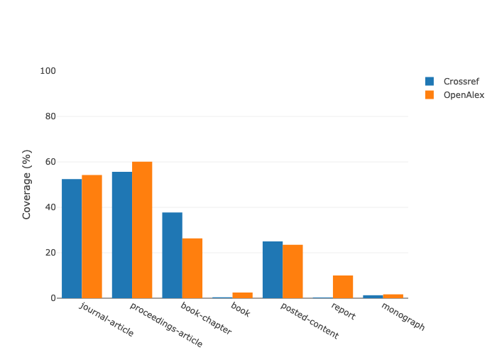
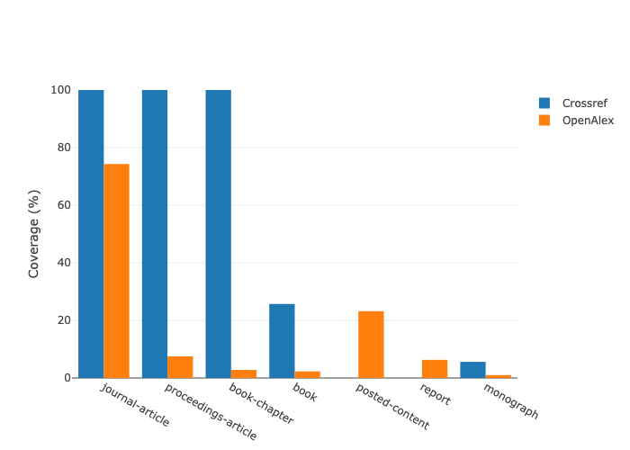
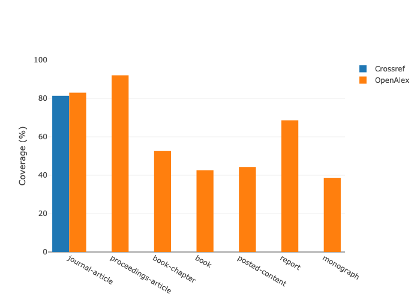

<!-- Loading JSON data files for access -->
<!-- TODO - these will currently break because they need to be created/added to the precipy index -->

<!-- Title Page -->
<pdf:nexttemplate name="titlepage">
<pdf:nextpage>

OPEN METADATA SOURCES

COMPARING OPENALEX TO CROSSREF AND MAG 
DATE: 22 FEBRUARY 2022

<!-- switch page templates -->
<pdf:nexttemplate name="report">

<pdf:nextpage>

# Executive Summary

Here we write some background stuff, probably using the abstracts we have I guess, can also include some
summary statistics and other useful things.

This report was run using the following tables as source data:
Crossref: academic-observatory.crossref.crossref_metadata20220107
Crossref Member Data: utrecht-university.crossref.member_data with date 2022-02-14
OpenAlex Native Format utrecht-university.OpenAlex.Work20220130
Microsoft Academic:

* Papers: academic-observatory.mag.Papers20211206
* Authors: academic-observatory.mag.Authors20211206
* Affiliations: academic-observatory.mag.Affiliations20211206
* Intermediate: utrecht-university.mag.mag_intermediate20211206

<pdf:nextpage>

# Contents

There is actually a way, I think of pulling in a table of contents, but I haven't done that previously. Or it can
be done manually obviously.

# Introduction and Background

Stuff on MAG going away and the motivation for tracking completeness

## Data sources

Do we need a section that gives some brief background on the data sources?

### Crossref Metadata

### Microsoft Academic

### OpenAlex

## Goals of this report

## Limitations

# Coverage of OpenAlex vs Crossref

## Comparing coverage

OpenAlex is based initially on metadata from Microsoft Academic and the overall coverage compared to Crossref is
consistent with for publications over all time. Noting that OpenAlex has made a decision to not cover all the 
content types that MAG did, these two charts show a difference for the non-Crossref materials but very similar
results for the content that has Crossref DOIs.

Therefore it is of interest to look at a specific recent year, in this case 2020.

## Value Add of OpenAlex to Crossref

### Overview

### Details

We can do loops eg over the data elements. But this might be better for a supplementary data section as we will 
presumably want to actually comment on the graphs themselves? 

TODO:
There is a bug in the xhtml2pdf package which means it
only works with complete paths on windows. This creates an issue as we would need to use precipy to give us the full
path but I'm not sure whether we can use a variable inside that full path declaration. Some experimentation required.

### Affiliation strings

The above will not work on windows...may need to figure a work around for that

### Authors

The above will not work on windows...may need to figure a work around for that

### Abstracts

The above will not work on windows...may need to figure a work around for that

### Citations to

The above will not work on windows...may need to figure a work around for that

### References from

The above will not work on windows...may need to figure a work around for that

### Journals

The above will not work on windows...may need to figure a work around for that

### Fields

The above will not work on windows...may need to figure a work around for that

# OpenAlex Coverage Beyond Crossref

## Publication Types

## Metadata Coverage

### Overall

### By publication type

### By field

# Methodology

# Appendices

## Appendix A - Complete Tables

## Appendix B - Historical MAG Analysis??

4. OpenAlex - non-Crossref coverage
4a. Publication types - with and without (Crossref?) DOIs
4b. Coverage of 6 main parameters - with /without (Crossref?) DOIs
4c. Coverage of 6 main parameters per publication type 
 - with/without (Crossref?) DOIs
5. Methodology
6. Appendix - tables with AllTheThingsTM
